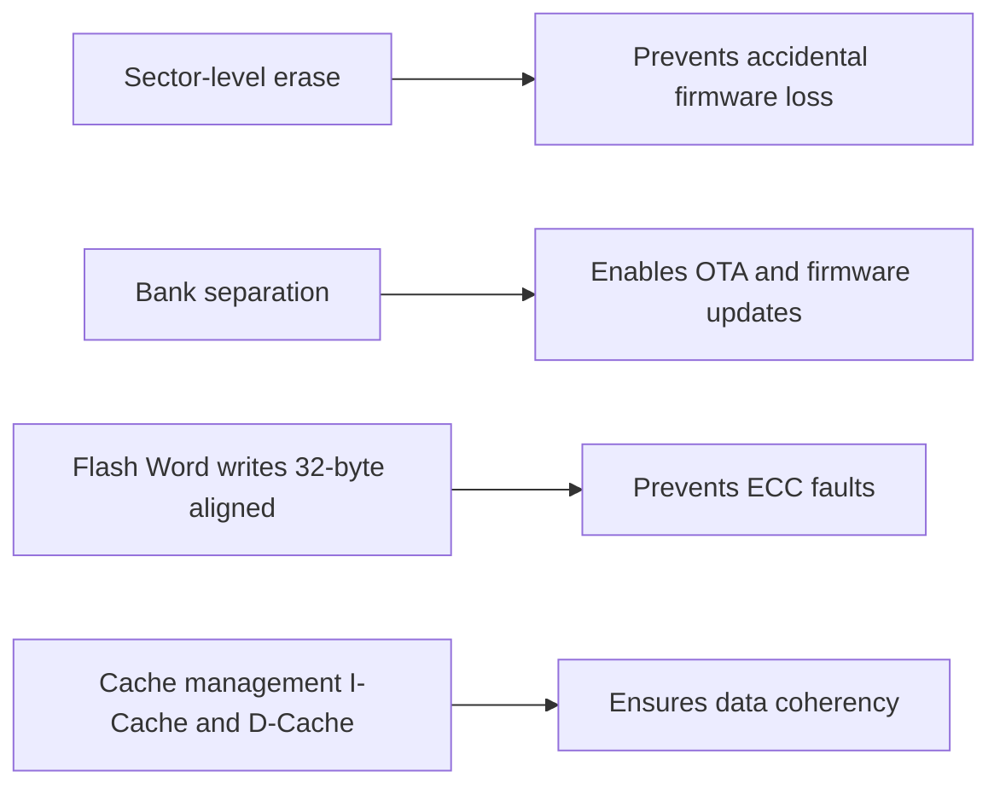

<div align="left">

<div align="left">

# 👨‍💻 Vaishnav Gophane
**Embedded Firmware Engineer**  
*Pune, India*

---

**Embedded Systems Developer specializing in**  
**STM32 • PIC • RTOS • CAN • Real-time Systems**

0.3)"/>

**Currently building**  
🔮 Production-grade firmware for industrial IoT  
⚡ High-performance data logging systems  
🚀 Real-time embedded architectures  

---

**🛠️ Core Technologies**


**📫 Get In Touch**
[](https://www.linkedin.com/in/vaishnav-gophane-417686284/)
[](mailto:mr.vaishnavgophane@gmail.com)
[](https://github.com/vaishnavgophane)

---
*Profile Views: *


**📫 Connect**
[](https://www.linkedin.com/in/vaishnav-gophane-417686284/)
[](mailto:mr.vaishnavgophane@gmail.com)
[](https://github.com/vaishnavgophane)


**Flash Memory Architecture**

    Bank 1 (Sectors 0-126) → [Application Code] → Flash Controller
    Bank 2 (Sector 127: 0x081FF800) → [User Data: 128KB] → 32B AXI Writes → Non-Volatile Storage

---

# STM32H7 Flash Memory Handling (Code + Data Separation)

## 📌 Project Overview

This project demonstrates **safe and deterministic Flash memory handling** on an **STM32H7 series microcontroller**.
The key idea is to **separate application code and user data in internal Flash**, ensuring:

* Application firmware remains intact during updates
* User data persists across resets and firmware re-flashing
* Flash programming follows STM32H7 architectural constraints (32‑byte Flash Word)

The project writes structured data into Flash memory, reads it back at runtime, and validates proper memory partitioning.

---

## 🧠 Memory Architecture Strategy

STM32H7 devices use **dual-bank Flash** with **sector-based erase** and **Flash Word (256‑bit / 32‑byte) programming**.

### Memory Layout Used

| Region                         | Usage              | Notes                        |
| ------------------------------ | ------------------ | ---------------------------- |
| **Bank 1 – Sector 0–1**        | Application Code   | Reserved for firmware only   |
| **Bank 1 – Remaining Sectors** | User Data          | Safe from firmware overwrite |
| **Bank 2**                     | Optional Expansion | Available for logs / configs |

✔ This guarantees **data persistence even when firmware is updated**.

---

## ⚙️ Key Technical Highlights

### 1️⃣ Flash Write Granularity (STM32H7 Specific)

* Flash programming **must be done in 32‑byte chunks**
* Uses `FLASH_TYPEPROGRAM_FLASHWORD`
* Data buffers are aligned to Flash Word boundaries

```c
HAL_FLASH_Program(FLASH_TYPEPROGRAM_FLASHWORD,flash_address,(uint32_t)&data[i]);
```

---

### 2️⃣ Safe Sector Erase Handling

* Sector erase is **mandatory before writing**
* Only the **designated data sector** is erased
* Code sectors remain untouched

```c
EraseInit.TypeErase = FLASH_TYPEERASE_SECTORS;
EraseInit.Banks     = FLASH_BANK_2;
EraseInit.Sector    = FLASH_SECTOR_127;
EraseInit.NbSectors = 1;
```

---

### 3️⃣ Cache & MPU Awareness

STM32H7 uses **I‑Cache, D‑Cache, and AXI bus**, which can corrupt Flash reads if not handled correctly.

Mitigations used:

* D‑Cache disabled during Flash operations
* MPU configured to avoid illegal memory access

```c
SCB_DisableICache();
SCB_DisableDCache();
```

---

### 4️⃣ Flash Read (Memory‑Mapped Access)

Flash is memory‑mapped, allowing **direct pointer access**:

```c
buffer[i] = *(uint32_t *)(flash_address + i * 4);
```

✔ No HAL function needed for read operations

---

📦 Data Example (Real Hardware Signal Capture)

While static arrays were used during initial validation, the actual data written to Flash originates from real hardware signals.

Signal Source

Digital Function Generator / External Supply

Logic-level inputs (0s and 1s)

Represents real-world digital events

Data Acquisition Concept

The microcontroller samples digital input states over time and stores them as packed binary data in Flash memory.
```c
uint32_t data_to_store[8]; // Captured digital signal states
uint32_t read_buffer[8];
```
Each bit represents a sampled logic level:

Bit Value	Meaning
0	Logic LOW
1	Logic HIGH

This approach simulates:

Event logging

State recording

Digital waveform snapshots

✔ The Flash storage mechanism remains identical, proving the system works with live external signals, not just test constants.

🔐 Reliability & Safety Considerations


## 🚀 Why This Matters (My Contribution)

This project demonstrates **professional-grade memory handling**, commonly required in:

- **Bootloaders**
- **OTA update systems**
- **Configuration storage**
- **Data logging applications**

## 👨‍💻 My Key Contributions

- ✔ **Designed safe Flash partitioning strategy**
- ✔ **Implemented STM32H7-compliant Flash write routines**
- ✔ **Managed cache and MPU interactions correctly**
- ✔ **Ensured data persistence across resets and firmware re-flashing**


This reflects real‑world embedded firmware practices, not just a demo.

* Written once at startup
* Read back to verify integrity

---

## 🔐 Reliability & Safety Considerations

| Feature            | Benefit                           |
| ------------------ | --------------------------------- |
| Sector‑level erase | Prevents accidental firmware loss |
| Bank separation    | Enables OTA / firmware updates    |
| Flash Word writes  | Prevents ECC faults               |
| Cache management   | Ensures data coherency            |

---

## 🚀 Why This Matters (My Contribution)

This project demonstrates **professional‑grade memory handling**, commonly required in:

* Bootloaders
* OTA update systems
* Configuration storage
* Data logging applications

### My Key Contributions

* ✔ Designed **safe Flash partitioning strategy**
* ✔ Implemented **STM32H7‑compliant Flash write routines**
* ✔ Managed **cache & MPU interactions** correctly
* ✔ Ensured **data persistence across resets & re‑flashing**

This reflects **real‑world embedded firmware practices**, not just a demo.

---

## 🛠️ Hardware & Tools

* **MCU**: STM32H7 Series
* **IDE**: STM32CubeIDE
* **HAL Driver**: STM32H7 HAL
* **Language**: C

---

## 📚 References

* STM32H7 Reference Manual (RM0455)
* STM32 HAL Flash Programming Guidelines

---

## ✅ Status

✔ Flash Write Tested
✔ Flash Read Verified
✔ Sector Isolation Confirmed

---

### ⭐ If you find this useful, feel free to star the repository!
